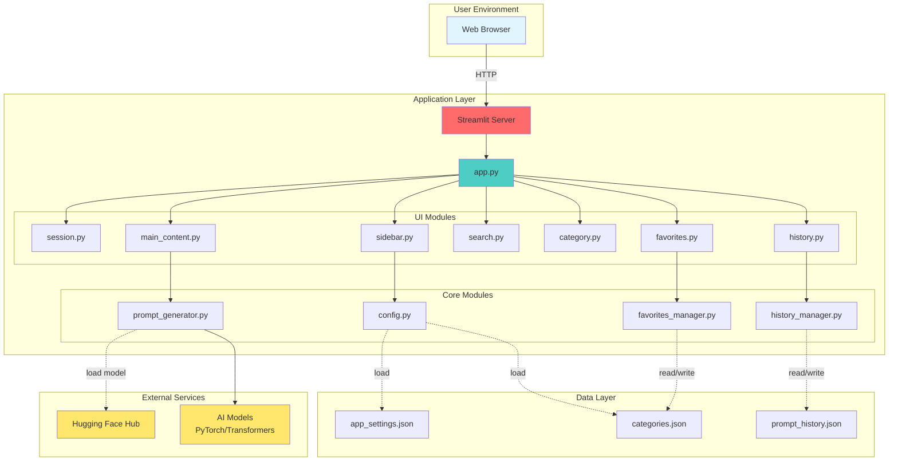
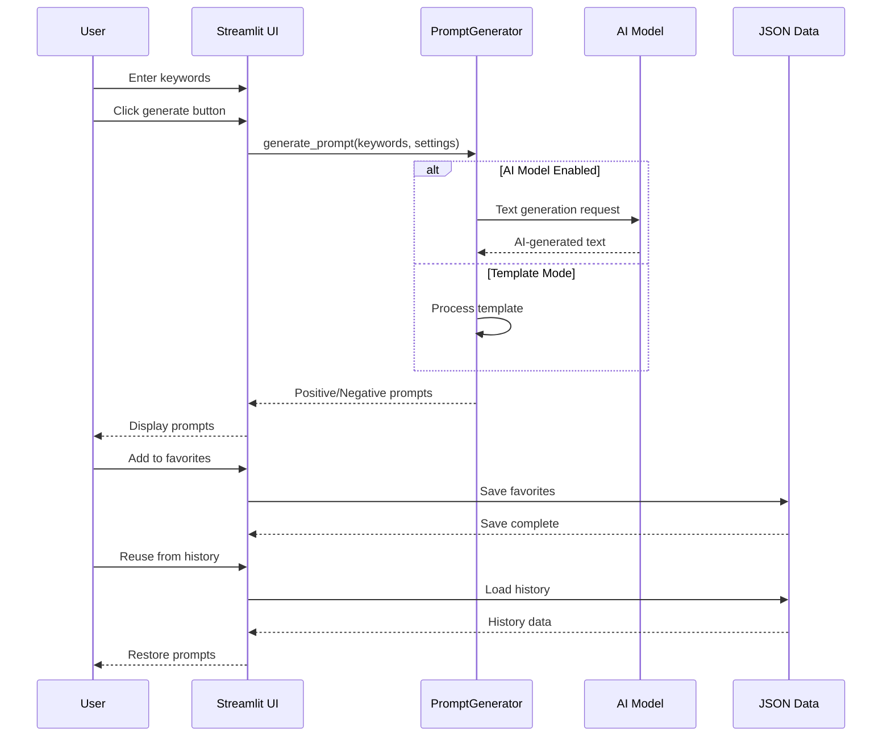
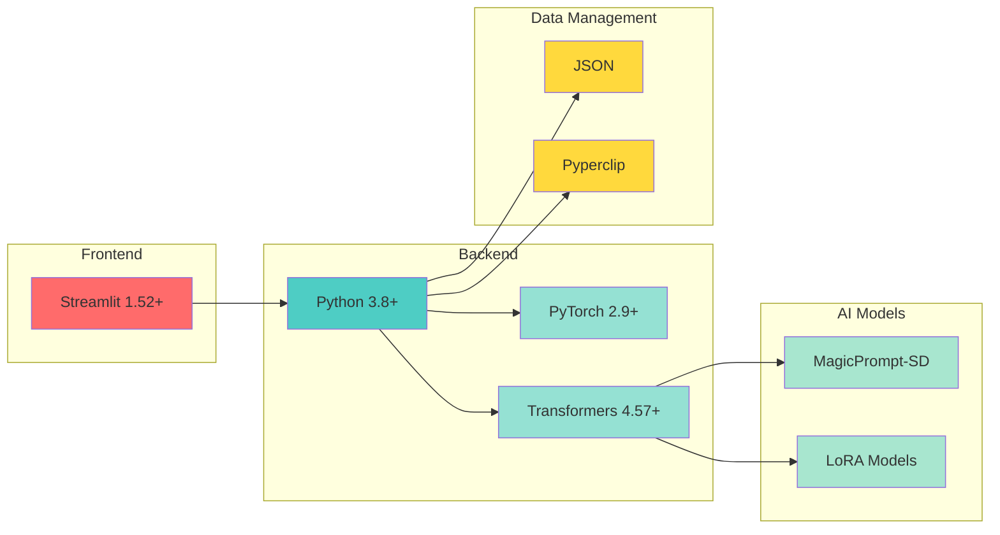

# PromptCrafter2: Stable Diffusion Prompt Generation Tool

## Overview

PromptCrafter2 is a web application designed to assist users in generating high-quality prompts for Stable Diffusion, a powerful text-to-image generation model. It utilizes a Streamlit-based interface, offering a user-friendly experience for creating both positive and negative prompts. The application supports model-based prompt generation using a pre-trained text generation model (default: `Gustavosta/MagicPrompt-Stable-Diffusion`) or template-based generation. It also allows users to easily incorporate LoRA models and provides a categorized keyword selection system.

## Features

-   **Web-Based Interface:** Easy browser-based access
-   **Template-Based & Model-Based Prompt Generation:** Generate prompts based on templates or utilize an AI model for more dynamic and varied outputs.
-   **Prompt History:** Record and reuse previously generated prompts
-   **Favorites Management:** Register frequently used prompts and keywords as favorites for quick access
-   **NSFW Support:** Includes a wide range of NSFW keywords and categories for research purposes.
-   **Categorized Keyword Selection:** Choose keywords from a structured, multi-level category system (Nature, People, Buildings, etc.) with associated subcategories.
-   **LoRA Support:** Easily incorporate LoRA models into your prompts.
-   **Prompt Search:** Search for keywords or phrases to add to prompts with search functionality.
-   **CSV Import:** Import additional prompts from a CSV file.
-   **Customizable Templates:** Modify prompt templates via the application's settings.
-   **Copy & Paste:** Generated prompts can be easily copied to the clipboard.
-   **AI Generation Mode:** Choose which prompts the AI will generate (positive, negative, or both)
-   **Responsive UI:** Automatically adjusts to browser window size

## Repository Structure

```
promptcrafter2/
│
├── app/
│   ├── __init__.py
│   ├── config.py              # Configuration and settings
│   ├── prompt_generator.py    # Prompt generation logic
│   ├── favorites_manager.py   # Favorite prompt management
│   ├── history_manager.py     # Prompt history management
│   └── ui/
│       ├── __init__.py
│       ├── session.py         # Session state initialization
│       ├── sidebar.py         # Sidebar UI (Settings)
│       ├── main_content.py    # Main content UI (Prompt generation)
│       ├── search.py          # Search UI
│       ├── category.py        # Category selection UI
│       ├── favorites.py       # Favorites management UI
│       └── history.py         # History UI
│
├── app.py                     # Application entry point (Streamlit)
├── requirements.txt           # Required packages
├── app_settings.json          # Application settings
├── categories.json            # Category data
├── prompt_history.json        # Prompt history (auto-generated)
├── README.md                  # This file (English version)
├── README-ja.md               # Japanese README
├── user_manual-en.md          # English user manual
├── user_manual-jp.md          # Japanese user manual
├── code_overview-en.md        # English code overview
└── code_overview-jp.md        # Japanese code overview
```
## Technical Architecture

### System Architecture Diagram



### Data Flow Diagram



### Technology Stack


## Getting Started

1. **Clone the Repository:**

    ```bash
    git clone https://github.com/yf591/promptcrafter2.git
    cd promptcrafter2
    ```

2. **Create and Activate Virtual Environment:**

    **macOS/Linux:**
    ```bash
    python3 -m venv .venv
    source .venv/bin/activate
    ```

    **Windows:**
    ```bash
    python -m venv .venv
    .venv\Scripts\activate
    ```

3. **Install Dependencies:**

    ```bash
    pip install -r requirements.txt
    ```

4. **Run the Application:**

    ```bash
    streamlit run app.py
    ```

    The application will automatically open in your browser (or navigate to http://localhost:8501)

## Configuration

The application's settings can be modified through `app/config.py` and in the setting windows.

-   `"realistic_positive_prompt_template"`:  Positive prompt template for generating realistic images.
-   `"realistic_negative_prompt_template"`: Negative prompt template for generating realistic images.
-   `"2d_positive_prompt_template"`: Positive prompt template for generating 2D images.
-   `"2d_negative_prompt_template"`: Negative prompt template for generating 2D images.
-   `"2.5d_positive_prompt_template"`: Positive prompt template for generating 2.5D images.
-   `"2.5d_negative_prompt_template"`: Negative prompt template for generating 2.5D images.
-   `"nsfw_realistic_positive_prompt_template"`:  Positive prompt template for generating NSFW realistic images.
-   `"nsfw_realistic_negative_prompt_template"`: Negative prompt template for generating NSFW realistic images.
-   `"nsfw_2d_positive_prompt_template"`: Positive prompt template for generating NSFW 2D images.
-   `"nsfw_2d_negative_prompt_template"`: Negative prompt template for generating NSFW 2D images.
-   `"nsfw_2.5d_positive_prompt_template"`: Positive prompt template for generating NSFW 2.5D images.
-   `"nsfw_2.5d_negative_prompt_template"`: Negative prompt template for generating NSFW 2.5D images.
-   `"model_name"`: Name of the model to use for prompt generation (default: `Gustavosta/MagicPrompt-Stable-Diffusion`).
-   `"use_model_for_generation"`: Boolean to enable or disable AI-based prompt generation.
-   `"auto_generate_areas"`: List of keyword categories for AI-based generation.
-   `"ai_generation_mode"`: The mode for AI prompt generation (positive, negative, or both).
-   `"loras"`: List of LoRA models to choose from.
-   `"selected_positive_template"`: Key of the positive prompt template to use.
-   `"selected_negative_template"`: Key of the negative prompt template to use.

## Disclaimer
This application is intended for research purposes and is used at your own risk. The author is not responsible for any misuse or harm caused by the use of this application.

## Developer
yf591

## License

This application is released under the **Creative Commons Attribution-NonCommercial-ShareAlike 4.0 International (CC BY-NC-SA 4.0)** License.

This means that you are free to:

*   **Share** — copy and redistribute the material in any medium or format
*   **Adapt** — remix, transform, and build upon the material

Under the following terms:

*   **Attribution** — You must give appropriate credit, provide a link to the license, and indicate if changes were made. You may do so in any reasonable manner, but not in any way that suggests the licensor endorses you or your use.
*   **NonCommercial** — You may not use the material for commercial purposes.
*   **ShareAlike** — If you remix, transform, or build upon the material, you must distribute your contributions under the same license as the original.

More details about this license can be found at [https://creativecommons.org/licenses/by-nc-sa/4.0/](https://creativecommons.org/licenses/by-nc-sa/4.0/).

This license is intended to protect the author's rights and encourage the sharing of knowledge and innovation. If you are interested in commercial use, please contact the author for permission.